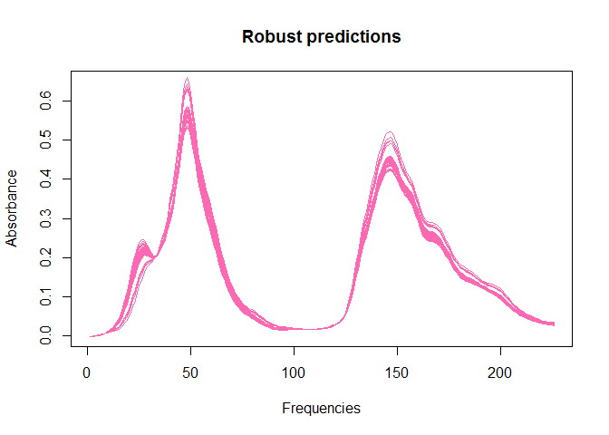
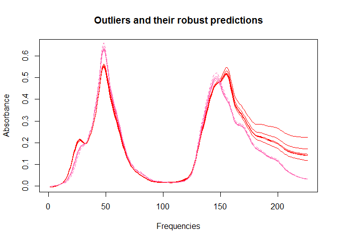

S-PCA
================
Matias Salibian
2016-12-30

The octane dataset contains 39 (n) near-infrared (NIR) absorbance spectra over 226 (p) different wavelengths. It was first discussed in Esbensen, Sch"onkopf, and Midtgaard, 1994, Multivariate Analysis in Practice, Trondheim: Camo. It is known that samples 25, 26, and 36:39 contain added alcohol, and are thus atypical. See [Hubert, Rousseeuw and Vanden Branden (2005)](http://dx.doi.org/10.1198/004017004000000563) for more details.

To compute the S-PCA approximations, first load the necessary functions:

``` r
source('S-FPCA-functions.R')
```

A multi-core version of the code is available via the function `sfpca.par` that distributes the random starts to different cores, if they are present. In this example we assume that we have 4 cores available.

``` r
library(doParallel)
cl <- makeCluster(4)
registerDoParallel(cl)
```

Now read the data:

``` r
x <- read.csv('octane.csv', header=TRUE, dec=',')
x <- x[ ,-(1:2)]
```

Compute an initial location estimate using the L1 estimator, implemented in the `pcaPP` package:

``` r
mui <- l1median(X=x, trace=-1)
```

We now compute the robustly estimated 2-dimensional principal subspace, using `Ncand = 1000` random starts. This takes a long time to compute (about 1hr in my computer):

``` r
q <- 2
Ncand <- 1000
x.s <- sfpca.par(x=x, mu=mui, q=q, Ncand=Ncand, seed=123, init.it=50, max.it=500, 
                 tol=1e-6, trace=FALSE, tuning.rho=3, bb = 0.2426)
```

We now compute the residuals between the observations and their robust 2-dimensional approximations:

``` r
mu.hat <- x.s$mu
xc <- scale(x, center=x.s$mu, scale=FALSE)
bon <- qr.Q(qr(x.s$b))
x.hat.s <- scale( (xc %*% bon) %*% t( bon ), center=-x.s$mu, scale=FALSE)
re.s <- rowMeans((x-x.hat.s)^2)
```

To determine whether any of these residuals is atypical, and considering the natural skewness of squared distances, we use the adjusted boxplot of [Hubert and Vandervieren (2008)](http://dx.doi.org/10.1016/j.csda.2007.11.008) as implemented in the `robustbase` package:

``` r
names(re.s) <- 1:nrow(x)
ouS <- as.numeric(names(adjbox(re.s, plot=FALSE)$out))
inliers <- re.s[ouS] < median(re.s)
outs.s <- ouS[!inliers]
outs.true <- c(25, 26, 36:39)
all.equal(outs.s, outs.true)
```

    ## [1] TRUE

All known outliers are correctly identified. We now stop our cluster:

``` r
stopCluster(cl)
```

Look at the original data, the robust predictions (in pink) and the detected outliers (in red)   
